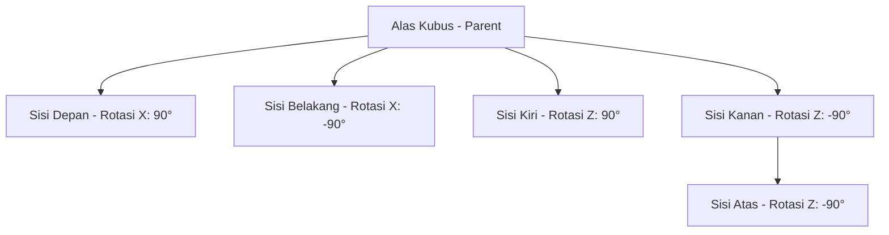

# Analisis Interaktivitas Geometry di Frontend (React)

Dokumen ini menganalisis struktur data geometri yang dihasilkan oleh [geometry_service.py](file:///e:/laragon/www/Python%20Math%20Engine/app/services/geometry_service.py) dan memetakan kelayakan teknis untuk membangun visualisasi interaktif di frontend React (memutar, mengklik, membuka jaring-jaring, dll.).

---

## 1. Apakah Mungkin Dilakukan dengan Data Sekarang?

> [!IMPORTANT]
> **Sangat Mungkin!** Data yang dihasilkan oleh backend saat ini sudah sangat lengkap dan terstruktur secara standar grafis 3D profesional.

Mari kita bedah struktur data yang dikirim oleh `geometry_service.py`:

```json
{
  "meta": {
    "seed": 42,
    "level": 3,
    "shape": "cube",
    "dimension": "3D"
  },
  "data": {
    "expression": "Hitung volume kubus dengan sisi 10",
    "mesh": {
      "vertices": [
        [-5.0, -5.0, -5.0], [5.0, -5.0, -5.0], [5.0, 5.0, -5.0], [-5.0, 5.0, -5.0],
        [-5.0, -5.0, 5.0], [5.0, -5.0, 5.0], [5.0, 5.0, 5.0], [-5.0, 5.0, 5.0]
      ],
      "faces": [
        [0, 1, 2], [0, 2, 3], [4, 5, 6], [4, 6, 7],
        [0, 1, 5], [0, 5, 4], [2, 3, 7], [2, 7, 6],
        [0, 3, 7], [0, 7, 4], [1, 2, 6], [1, 6, 5]
      ]
    },
    "dimensions": {
      "side": 10
    },
    "perimeter": 120,
    "angles": null,
    "area": 600,
    "volume": 1000,
    "correct_answer": "1000"
  }
}
```

### Mengapa data ini sangat ideal?
1. **Representasi Mesh 3D Standar (`vertices` & `faces`)**:
   - `vertices` berisi koordinat titik sudut $(x, y, z)$.
   - `faces` berisi indeks titik-titik penyusun bidang sisi (segitiga atau poligon).
   - Format ini adalah standar industri grafis 3D (seperti format file `.obj` atau `.gltf`) yang dapat dibaca secara langsung oleh pustaka WebGL seperti **Three.js** tanpa konversi rumit.
2. **Ukuran Asli (`dimensions`)**:
   - Memuat variabel acak yang dihasilkan backend (misal: `side: 10`, `length`, `width`, `height`, dll.). Ini memungkinkan kita merender teks ukuran (label dimensi) secara dinamis tepat di posisi objek.

---

## 2. Pilihan Library di Frontend React

Untuk merender data di atas secara interaktif di React, berikut adalah opsi terbaik beserta perbandingannya:

### Opsi A: React Three Fiber (R3F) & `@react-three/drei` (REKOMENDASI UTAMA ⭐)
**React Three Fiber** adalah React *renderer* untuk **Three.js**. Library ini mengubah Three.js menjadi komponen-komponen React deklaratif.

- **Kelebihan**:
  - **Sangat Selaras dengan Data Kita**: Kita bisa langsung membuat custom geometry menggunakan array `vertices` dan `faces` dari API.
  - **Interaksi Mudah**: Event klik, hover, dan drag dapat ditangani seperti event React biasa (`onClick`, `onPointerOver`).
  - **Akselerasi GPU**: Grafis 3D sangat mulus dan terasa premium.
  - **Dukungan OrbitControls**: Siswa bisa memutar, memperbesar (*zoom*), dan menggeser kamera secara bawaan.
- **Kekurangan**: Memiliki *learning curve* jika belum terbiasa dengan konsep 3D (kamera, pencahayaan, material).

### Opsi B: Mathigon Polypad
**Polypad** adalah platform virtual manipulatif matematika yang luar biasa interaktif.

- **Kelebihan**: Sangat kaya fitur edukasi matematika siap pakai, termasuk pelipatan jaring-jaring (*folding nets*) yang interaktif.
- **Kekurangan**:
  - **Sulit Kustomisasi Data Dinamis**: Polypad dirancang sebagai *widget/sandbox* mandiri. Sangat sulit bagi kita untuk menyuntikkan koordinat custom `vertices` dan `faces` acak dari backend kita ke dalam komponen Polypad.
  - Kita harus mengikuti struktur dan logika internal mereka, yang membatasi fleksibilitas visualisasi soal-soal unik kita.

### Opsi C: GeoGebra Web Integration
- **Kelebihan**: Sangat baik untuk grafik fungsi, kalkulus, dan konstruksi geometri standar.
- **Kekurangan**: Berat untuk dimuat (*loading time*), tampilan visual kurang modern/premium (terkesan kaku seperti aplikasi desktop 90-an), dan integrasi data dynamic mesh cukup rumit.

---

## 3. Cara Mengimplementasikan Interaksi Utama

Berikut adalah cara menerjemahkan fitur-fitur yang Anda inginkan menggunakan **React Three Fiber (R3F)**:

### 1️⃣ Fitur Memutar & Memperbesar (Rotate & Zoom)
Menggunakan komponen `<OrbitControls />` dari `@react-three/drei`. Siswa dapat menyeret mouse/sentuhan layar untuk memutar bangun ruang dari segala arah.

### 2️⃣ Fitur Mengklik Bidang Sisi (Interactive Clicks)
Karena setiap `face` didefinisikan sebagai indeks vertex, kita bisa mendeteksi klik pada bidang sisi tertentu untuk:
- Mengubah warna sisi yang diklik (highlight).
- Membuka informasi sisi (misal: "Sisi depan: Luas = 100 cm²").
- Menyembunyikan sisi tertentu agar siswa bisa melihat bagian dalam bangun ruang (rongga).

### 3️⃣ Fitur Membuka Jaring-jaring (Unfolding / Nets)
Untuk membuat fitur "membuka" bidang menjadi jaring-jaring 2D, ada dua pendekatan:

#### Pendekatan A: Unfolding Animasi 3D (Premium & Wow Factor)
Kita membagi mesh menjadi beberapa kelompok bidang sisi (misal: alas, depan, belakang, kiri, kanan, atas). Di R3F, kita menggunakan konsep *hierarki parent-child* untuk membuat "engsel" (hinges) pada tepi bidang, lalu memutar sudut engsel dari $0^\circ$ (tertutup) ke $90^\circ$ atau sudut tertentu (terbuka) menggunakan library animasi seperti `@react-spring/three` atau `framer-motion-3d`.



#### Pendekatan B: Toggle View 2D & 3D (Lebih Mudah Diimplementasikan)
Jika jaring-jaring 3D terlalu kompleks, kita bisa membuat template jaring-jaring 2D berbasis SVG/Canvas untuk setiap jenis bentuk.
- Ketika siswa menekan tombol "Buka Jaring-jaring", kita menyembunyikan canvas 3D dan menampilkan diagram SVG 2D datar yang ukurannya disesuaikan dengan `data.dimensions` dari backend.

---

## 4. Contoh Implementasi di React (React Three Fiber)

Berikut adalah contoh komponen React yang memuat data `mesh` dari Laravel API dan menampilkan bangun 3D interaktif yang bisa diputar dan diklik:

```jsx
import React, { useRef, useState, useMemo } from 'react';
import { Canvas } from '@react-three/fiber';
import { OrbitControls, Grid } from '@react-three/drei';
import * as THREE from 'three';

// Komponen Pembentuk Bangun Geometri Kustom dari API
function CustomGeometry({ meshData }) {
  const [hoveredFace, setHoveredFace] = useState(null);
  const [clickedFace, setClickedFace] = useState(null);

  // Mengubah data vertices dan faces dari API menjadi format Three.js
  const geometry = useMemo(() => {
    const geom = new THREE.BufferGeometry();
    
    // Flatten array vertices [[x,y,z], ...] menjadi [x,y,z, x,y,z, ...]
    const verticesArray = new Float32Array(meshData.vertices.flat());
    
    // Flatten array faces [[v1,v2,v3], ...] menjadi indices
    const indicesArray = new Uint16Array(meshData.faces.flat());

    geom.setAttribute('position', new THREE.BufferAttribute(verticesArray, 3));
    geom.setIndex(new THREE.BufferAttribute(indicesArray, 1));
    geom.computeVertexNormals(); // Penting untuk pencahayaan yang realistis
    
    return geom;
  }, [meshData]);

  return (
    <mesh 
      geometry={geometry}
      onPointerOver={(e) => {
        e.stopPropagation();
        setHoveredFace(e.faceIndex);
      }}
      onPointerOut={() => setHoveredFace(null)}
      onClick={(e) => {
        e.stopPropagation();
        // Deteksi face/sisi mana yang diklik
        const faceIndex = Math.floor(e.faceIndex / 2); // Jika face mesh berupa segitiga
        setClickedFace(faceIndex);
        alert(`Siswa mengklik Bidang Sisi indeks ke-${faceIndex}`);
      }}
    >
      {/* Warna & Material premium (Glassmorphism look) */}
      <meshPhysicalMaterial 
        color={hoveredFace !== null ? "#3b82f6" : "#4f46e5"} 
        roughness={0.2}
        metalness={0.1}
        transparent={true}
        opacity={0.85}
        transmission={0.6} // Efek kaca tembus pandang premium
        side={THREE.DoubleSide}
      />
    </mesh>
  );
}

// Canvas Utama Render 3D
export default function GeometryViewer({ apiResponse }) {
  if (!apiResponse || !apiResponse.data.mesh) return <div>Memuat visualisasi 3D...</div>;

  return (
    <div style={{ width: '100%', height: '400px', background: '#0f172a', borderRadius: '12px', overflow: 'hidden' }}>
      <Canvas camera={{ position: [15, 15, 15], fov: 45 }}>
        {/* Pencahayaan agar terlihat premium */}
        <ambientLight intensity={0.6} />
        <directionalLight position={[10, 15, 10]} intensity={1.2} castShadow />
        <pointLight position={[-10, -10, -10]} intensity={0.5} />

        {/* Render Bangun Ruang */}
        <CustomGeometry meshData={apiResponse.data.mesh} />

        {/* Memungkinkan memutar, zoom, pan */}
        <OrbitControls enableDamping dampingFactor={0.05} />
        
        {/* Grid lantai bantu bernuansa modern sci-fi */}
        <Grid 
          position={[0, -5, 0]} 
          args={[30, 30]} 
          cellSize={1} 
          cellThickness={0.5} 
          cellColor="#334155" 
          sectionSize={5}
          sectionThickness={1}
          sectionColor="#475569"
          fadeDistance={30}
        />
      </Canvas>
    </div>
  );
}
```

---

## 5. Kesimpulan & Rekomendasi Langkah

1. **Gunakan React Three Fiber (R3F)**: Pilihan terbaik karena data `mesh` yang dihasilkan `geometry_service.py` saat ini adalah *drop-in match* untuk Three.js geometry.
2. **Hindari Polypad untuk Data Dinamis**: Polypad kurang cocok jika Anda ingin agar visualisasi 3D di-generate secara real-time berdasarkan variabel acak dari backend Laravel-Python Math Engine Anda.
3. **Mulai dari Fitur Dasar**:
   - Tahap 1: Tampilkan objek 3D interaktif yang bisa diputar, diperbesar, dan tembus pandang (sehingga bagian dalam seperti tinggi limas/prisma kelihatan).
   - Tahap 2: Tambahkan interaksi klik bidang sisi untuk memicu tooltip informasi ukuran sisi/sudut tersebut.
   - Tahap 3 (Membuka): Buat opsi *Toggle View* ke jaring-jaring 2D berbasis SVG, atau jika ingin efek sangat premium, implementasikan engsel rotasi 3D di React Three Fiber.
